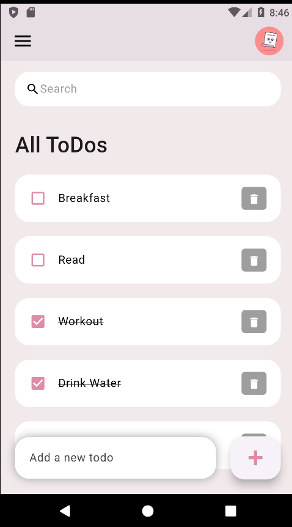

# ToDos Flutter App

A simple and elegant ToDo app built with Flutter, designed to help you manage your daily tasks efficiently. This app allows you to:

- Add new activities
- Mark activities as done
- Delete activities
- Search activities using the search bar



## Features

- **Add New ToDo**: Easily add tasks using the input field and the floating action button.
- **Mark as Done**: Tap the checkbox to mark a task as completed.
- **Delete ToDo**: Remove tasks by clicking the delete button.
- **Search ToDos**: Use the search bar to quickly find specific tasks.

## Getting Started

Follow these instructions to set up the project locally and run the app.

### Prerequisites

Ensure you have the following installed:
- Flutter SDK: [Installation Guide](https://docs.flutter.dev/get-started/install)
- Dart SDK
- Android Studio or Visual Studio Code (recommended)

### Installation

1. Clone the repository:
   ```bash
   git clone https://github.com/Nehachandavari/ToDos-using-flutter.git

